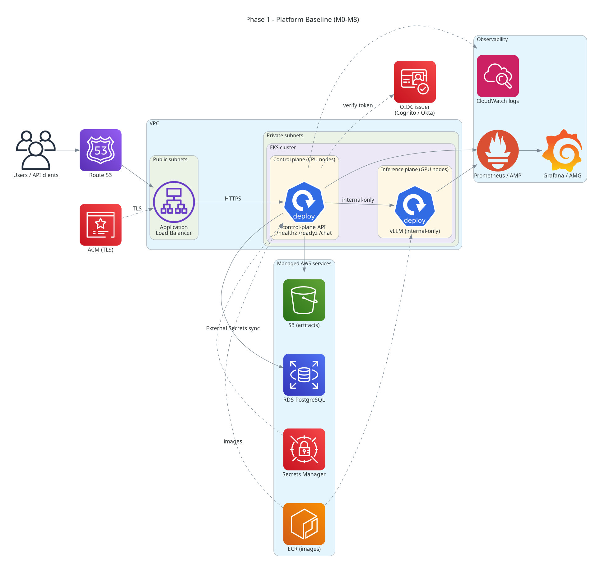
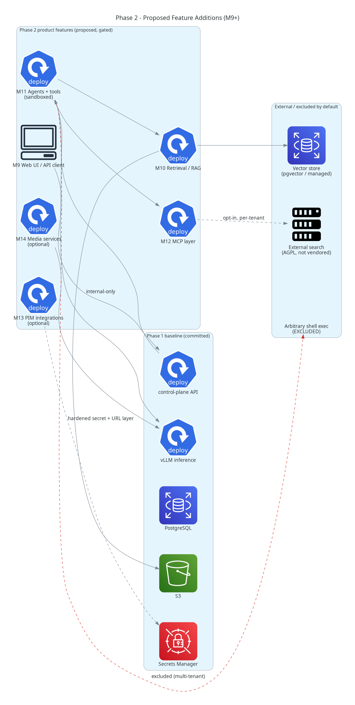

# Private AI Workspace on EKS

`private-ai-workspace-eks` is an open-source bootstrap for a self-hosted,
multi-user AI workspace designed for private organizational deployment on
AWS EKS.

## Positioning

This project is intended for:

- SMB and enterprise teams running a dedicated deployment inside their own environment
- private model serving via vLLM or compatible inference backends
- maintainer-controlled open-source development

This project is not presented as the official Odysseus project or an
AWS-endorsed derivative.

## Current Status

The project is delivered as a sequence of milestones (`docs/10-delivery-roadmap.md`).
The committed roadmap (M0–M8) builds the platform baseline; per-milestone build
instructions live in `docs/milestones/`.

| Milestone | Scope | Status |
| --- | --- | --- |
| M0 | Project bootstrap, governance, docs | Complete |
| M1 | Control-plane skeleton: authenticated chat path, OIDC token verification, session-store interface | Complete |
| M2 | EKS baseline: Terraform (VPC/EKS/ECR/RDS/S3), IRSA, ingress, External Secrets, CI/CD | Complete |
| M3 | Stateful dependency externalization (managed DB, object storage, session store) | Planned |
| M4 | Inference plane MVP (isolated vLLM on GPU) | Planned |
| M5 | Observability baseline (metrics, logs, traces) | Planned |
| M6 | Elastic GPU scaling | Planned |
| M7 | Staging hardening | Planned |
| M8 | Production release | Planned |

A component-level comparison of what is built versus planned is maintained in
`docs/11-gap-analysis.md`. Proposed product features beyond the baseline are
sequenced as a candidate M9+ track in `docs/12-phase-2-feature-adoption.md`.

## Architecture Direction

The target architecture follows a two-plane EKS design:

- a CPU-oriented control plane for API, auth, sessions, orchestration, and
  background work
- an isolated GPU-backed inference plane for vLLM or compatible model-serving
  workloads

The control plane should remain healthy and operationally visible when GPU
capacity is cold, scaling, or unavailable.

Diagrams are maintained as diagram-as-code: AWS architecture with the
[`diagrams`](https://diagrams.mingrammer.com/) library (official AWS icons) and
software views as UML with PlantUML. Sources and regeneration instructions are
in [`docs/diagrams/`](docs/diagrams/README.md); regenerate with
`scripts/generate-diagrams.sh`.

### Phase 1 — Platform Baseline (M0–M8)

The committed baseline: a public ALB fronts the CPU control plane; the GPU
inference plane (vLLM) stays internal-only; managed AWS services hold state,
secrets, and images; the control plane verifies bearer tokens against an OIDC
issuer.



### Phase 2 — Proposed Feature Additions (M9+)

Proposed, maintainer-gated product features layered on the Phase 1 baseline.
This track is exploratory and not committed scope; see
`docs/12-phase-2-feature-adoption.md` for the licensing and security analysis.
Components in the right-hand group are excluded from the default build
(AGPL-sensitive or non-vendored, e.g. arbitrary shell execution) and shown only
for context.



### Delivery and Software Views

The CI/CD and image supply chain, plus UML component and request-flow views of
the control plane, are in the [diagram gallery](docs/diagrams/README.md).

## Initial MVP Scope

The control plane runs without GPU capacity being available. The current
application surface includes:

- `/healthz` for liveness
- `/readyz` for explicit external dependency readiness
- `/v1/inference/status` for internal inference-plane configuration status
- `POST /v1/chat/completions`, an authenticated vLLM-compatible chat path that
  degrades gracefully when inference is unavailable
- OIDC bearer-token verification (RS256/ES256) with a development-only token
  verifier for local use
- auth and session domain primitives with a session-store interface

Non-goals:

- public exposure of inference services
- bundled AGPL-sensitive optional features
- local bind-mounted production state
- SQLite as a production database default

## Initial AWS Stack Decisions

The planning bundle recommends starting with:

- RDS PostgreSQL for relational state
- S3 for uploads and artifacts
- AWS Secrets Manager for managed secrets (synced via External Secrets Operator)
- Terraform for infrastructure provisioning
- Helm for Kubernetes packaging
- CPU nodes for the control plane
- managed GPU node groups first, with Karpenter considered after the baseline
- Prometheus-compatible metrics with CloudWatch/AMP/AMG integration options

Cost estimates for the provisioned infrastructure are in `ESTIMATION_COSTS.md`.

## Local Control-Plane Smoke Test

Install dependencies, run the tests, and start the service:

```bash
python3 -m pip install -e .
python3 -m unittest discover -s tests
python3 -m app.control_plane
```

For a local chat path in development mode, enable the development token
verifier (never set `DEV_AUTH_TOKEN` in staging or production):

```bash
ENVIRONMENT=development \
DEV_AUTH_TOKEN=local-dev-token \
INFERENCE_BASE_URL=http://vllm.inference.svc:8000 \
python3 -m app.control_plane
```

Production readiness requires external dependency configuration, for example:

```bash
DATABASE_URL=postgresql://example.invalid/workspace \
OBJECT_STORAGE_BUCKET=workspace-artifacts \
INFERENCE_BASE_URL=http://vllm.inference.svc:8000 \
AUTH_ISSUER_URL=https://issuer.example.com \
AUTH_AUDIENCE=private-ai-workspace \
AUTH_ADMIN_GROUP=workspace-admins \
python3 -m app.control_plane
```

## Repository Layout

```text
.
├── .github/        CI, deploy pipeline, issue and PR templates
├── app/            control-plane application (config, server, auth, inference)
├── deploy/         Helm charts (app, vLLM, observability, cluster add-ons)
├── docs/           planning bundle, gap analysis, milestone instructions
├── infra/          Terraform (VPC, EKS, ECR, RDS, S3, IRSA)
├── scripts/        local tooling and helper automation
└── tests/          control-plane and artifact tests
```

## Documentation

- Planning bundle and architecture: `docs/README.md`
- Delivery roadmap: `docs/10-delivery-roadmap.md`
- Gap analysis: `docs/11-gap-analysis.md`
- Phase 2 feature adoption track (proposed): `docs/12-phase-2-feature-adoption.md`
- Per-milestone build instructions: `docs/milestones/`
- Cost estimates: `ESTIMATION_COSTS.md`

## Governance

- pull requests are required for default-branch changes
- at least one maintainer review is required
- force-pushes to the protected branch are disabled
- contributors are expected to use DCO sign-off

See `CONTRIBUTING.md`, `SECURITY.md`, `CODE_OF_CONDUCT.md`, and `NOTICE`.

## Licensing

The repository is released under the MIT License. Attribution expectations for
upstream-inspired work are documented in `NOTICE`.
