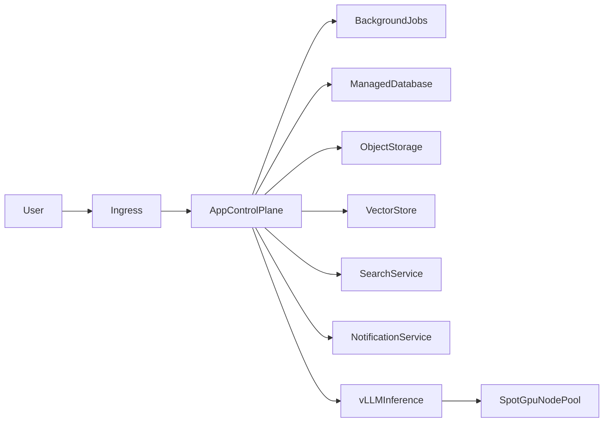

# Implementation Plan

## Goal

Build a new open-source AI workspace platform inspired by Odysseus, deployed on AWS EKS, with local-model inference served by vLLM on GPU nodes that can scale on demand.

## Architecture Direction

Separate the system into two major planes:

- **control plane**: API, web UI, auth, sessions, orchestration, task management, provider routing, background jobs
- **inference plane**: vLLM-backed local model serving on GPU nodes, independently scalable

## Target Topology

## Core Design Rules

- do not keep SQLite as the default production database
- do not rely on local bind-mounted app state for production
- treat search, vector storage, notifications, and model serving as explicit services
- keep the app horizontally scalable even if the first production milestone runs single replica

## Phase Plan

### Phase 1

Run the application on EKS with a single app replica and externalized configuration.

Deliverables:

- containerized app image
- Kubernetes manifests or Helm chart
- secret and config separation
- production database selection

### Phase 2

Externalize stateful dependencies.

Deliverables:

- managed relational database
- object storage for uploads and artifacts
- external vector store strategy
- background-worker separation where needed

### Phase 3

Add GPU inference using vLLM.

Deliverables:

- separate vLLM deployment
- internal model-routing contract from app to inference
- model lifecycle and cold-start strategy

### Phase 4

Enable elastic GPU scaling and app hardening.

Deliverables:

- spot GPU node autoscaling
- inference autoscaling metrics
- fallback and capacity rules
- observability and cost controls

## Recommended First Build Scope

Include:

- chat and model orchestration core
- authentication and admin controls
- artifact and document handling only if needed for the MVP
- externalized persistence
- vLLM integration for local models

Exclude initially:

- AGPL-sensitive optional features
- low-value integrations not needed for the MVP
- any feature that assumes single-host local tooling

## Initial Technical Decisions To Make

- choose the production database
- choose the vector store pattern
- choose whether search is bundled as an external service or made optional
- define the inference API contract between app and vLLM
- define spot-capacity fallback behavior
