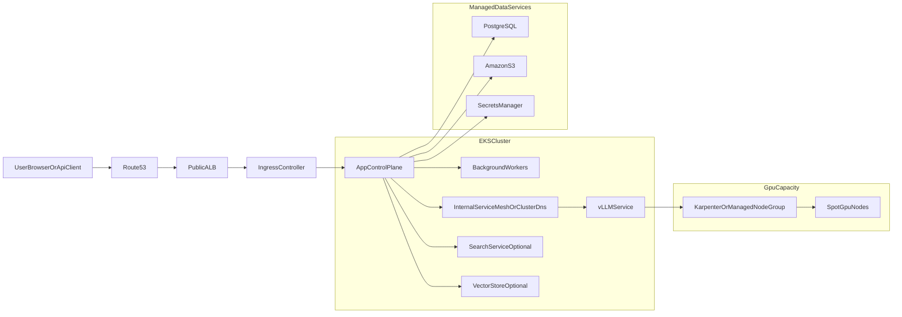

# Cloud Architecture

## Purpose

This document expands the earlier implementation plan into a concrete AWS target architecture for a new open-source AI workspace platform inspired by Odysseus, running on Amazon EKS with local-model inference served by vLLM on GPU spot capacity.

## Architecture Summary

The recommended target is a two-plane design:

- **application control plane** on general-purpose Kubernetes nodes
- **GPU inference plane** on isolated EKS workloads backed by spot GPU node groups or Karpenter-provisioned GPU capacity

The control plane should remain usable even when GPU capacity is cold, scaling, or temporarily unavailable.

## AWS Service Mapping

### Core platform

- `Amazon EKS`: primary Kubernetes control plane
- `Amazon ECR`: container image registry
- `Application Load Balancer`: ingress for web UI and public API
- `Route 53`: DNS
- `ACM`: TLS certificates

### State and storage

- `Amazon RDS PostgreSQL` or `Aurora PostgreSQL`: primary relational database
- `Amazon S3`: uploads, artifacts, exported data, model manifests, logs where needed
- external vector store:
  - hosted service, or
  - self-managed vector database in EKS, depending MVP scope

### Compute pools

- CPU node pool for app, workers, and non-GPU services
- GPU node pool for vLLM inference
- spot-first GPU strategy with on-demand fallback if reliability requires it

### Secrets and identity

- `AWS Secrets Manager` or parameter store for app secrets
- `IAM Roles for Service Accounts` for pod-level AWS access

### Observability

- `Prometheus` and `Grafana` in-cluster or managed equivalents
- `CloudWatch` for cluster and infrastructure logs
- optional OpenTelemetry for traces

## Recommended Networking Layout

Use a VPC with at least:

- public subnets for the load balancer
- private subnets for EKS nodes
- separate security groups for ingress, app workloads, database, and internal services

Recommended flow:

- internet traffic terminates at ALB
- ALB forwards to ingress controller or directly to Kubernetes services
- application pods run only in private subnets
- database is private-only
- inference endpoints are internal-only and reachable only from application workloads

## Logical Topology

## Workload Separation

### Control plane workloads

These run on standard CPU nodes:

- web UI and API
- auth and session handling
- orchestration and agent tasks
- background jobs
- integration services

Characteristics:

- horizontally scalable
- low startup latency
- not dependent on GPU node readiness

### Inference plane workloads

These run on GPU nodes:

- vLLM model-serving pods
- optional model pre-warm jobs
- optional embedding or reranking services if they need GPU

Characteristics:

- isolated scheduling
- higher cold-start time
- separate autoscaling behavior

## Model Serving Pattern

The application should not embed heavy model-serving logic directly. Instead:

- app calls a stable internal inference API
- inference service routes to one or more vLLM deployments
- each model family can have its own deployment if needed

Recommended API responsibilities:

- model selection
- request shaping
- timeout and retry behavior
- fallback if no GPU capacity is ready
- usage and latency metrics

## Spot GPU Scaling Strategy

Use a spot-first design, but do not make the control plane depend on immediate GPU availability.

Recommended behavior:

- provision GPU nodes only when inference demand crosses a threshold
- keep a minimal warm pool for the most important model if latency matters
- allow queued or degraded behavior when the GPU pool is scaling up
- define optional fallback paths:
  - smaller local model
  - external API model
  - retry-after response

Recommended components:

- `Karpenter` for dynamic GPU node provisioning, or
- managed GPU node groups if you want simpler first-phase operations
- `HPA` or `KEDA` for pod autoscaling based on custom inference metrics

## Autoscaling Signals

The scaling policy should not rely only on CPU.

Better metrics include:

- pending inference request count
- tokens per second saturation
- active request concurrency
- queue depth
- model-specific latency SLO breach rate

For the control plane, use standard metrics:

- CPU
- memory
- request latency
- worker queue depth

## Storage Design

### Database

Do not use SQLite in production.

Recommended:

- PostgreSQL-compatible managed database

Store:

- users
- sessions
- task metadata
- app configuration
- audit records

### Object storage

Use S3 for:

- uploads
- generated documents
- export archives
- optional cached model metadata

### Vector data

Choose one early:

- managed vector search service
- self-hosted vector DB on EKS
- Postgres plus vector extension if scope stays small

## Security Design

### Identity and secrets

- use IRSA for pods that access AWS services
- never store cloud credentials in static Kubernetes secrets if avoidable
- keep database and signing secrets in Secrets Manager

### Network boundaries

- public traffic only reaches ALB and ingress
- app-to-vLLM traffic stays internal
- database remains private-only
- use network policies for sensitive namespaces where practical

### Image and supply chain

- store all first-party images in ECR
- sign images if possible
- scan images in CI before promotion
- review third-party base images and licenses before use

## Deployment Model

### Recommended repository split

You may choose either:

- one repo with `app/`, `infra/`, and `docs/`, or
- separate repos for application and infrastructure

For the first build, one repo is simpler if ownership is still centralized.

### CI/CD flow

Recommended pipeline:

1. lint and test
2. build image
3. scan dependencies and image
4. push image to ECR
5. deploy to development cluster
6. promote to staging
7. gated production deploy

## Environment Strategy

Use at least three environments:

- `dev`
- `staging`
- `prod`

Suggested differences:

- dev may use smaller CPU-only fallback models
- staging should exercise the real deployment topology
- prod uses controlled GPU spot scaling and stricter policies

## Reliability And Failure Modes

Plan explicitly for:

- no spot GPU capacity available
- model container cold starts
- vector store degradation
- database failover
- failed rollout of inference deployment

Recommended control-plane behavior during inference outages:

- app remains available
- queued work is visible
- user gets clear degraded-mode messaging
- optional provider fallback is explicit and policy-controlled

## Cost Controls

Key levers:

- scale GPU only on demand
- separate heavyweight models from lightweight default models
- turn off unused warm pools in non-prod
- store large artifacts in S3, not persistent node disks
- set retention and lifecycle rules for logs and artifacts

## Recommended First AWS Build

Start with this minimal but valid architecture:

- EKS cluster
- ALB ingress
- one app deployment on CPU nodes
- PostgreSQL managed database
- S3 for file storage
- one isolated vLLM deployment on GPU nodes
- internal-only inference service
- basic Prometheus and Grafana metrics

Only after that is stable, add:

- spot elasticity tuning
- multiple model deployments
- advanced autoscaling metrics
- multi-AZ or advanced failover hardening for all layers

## Open Questions For Implementation

- should vector storage be external managed service or in-cluster
- should search be bundled as optional external service or omitted initially
- what model families need warm capacity from day one
- whether production requires on-demand GPU fallback for strict latency guarantees
- whether infrastructure should be Helm-first, Terraform-first, or mixed
