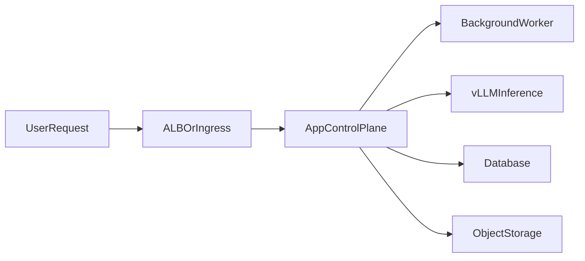

# Observability

## Status Check

The current bundle already mentions observability in:

- `06-cloud-architecture.md`
- `05-build-readiness-checklist.md`

But that coverage was only **high-level**. It named the tooling categories without fully describing the AWS-style observability architecture, telemetry layers, GPU metrics path, dashboards, alerting strategy, and production runbook expectations.

This document fills that gap.

## Observability Goal

Provide end-to-end visibility across:

- Kubernetes control plane and node health
- application control-plane health
- worker and queue behavior
- vLLM inference behavior
- GPU utilization and bottlenecks
- storage and database dependencies
- user-visible latency and error rates

## Signal Layers

The target stack should cover all three observability signals:

- **metrics** for SLOs, saturation, autoscaling, capacity, and alerting
- **logs** for debugging, audits, exceptions, rollout failures, and incident response
- **traces** for request flow across ingress, control plane, orchestration, and inference

## Recommended AWS-Compatible Observability Stack

### Option A: AWS-native leaning

Use AWS-native managed services where possible:

- `CloudWatch Observability Add-on`
- `CloudWatch Container Insights`
- `Amazon Managed Service for Prometheus`
- `Amazon Managed Grafana`
- `AWS Distro for OpenTelemetry`

Strengths:

- lower operational burden
- tighter AWS integration
- easier cluster-wide baseline visibility

### Option B: Kubernetes-native leaning

Use a more self-managed but flexible stack:

- `kube-prometheus-stack`
- `Prometheus`
- `Grafana`
- `Alertmanager`
- `OpenTelemetry Collector`
- optional `Loki` or another log backend

Strengths:

- maximum dashboard control
- easier multi-backend portability
- more community examples for vLLM and GPU exporters

### Recommended project choice

For this project, the best practical starting point is:

- `AMP` + `AMG` or `Prometheus` + `Grafana`
- `ADOT` or OpenTelemetry Collector for traces
- `CloudWatch` for infrastructure and control-plane logs

That gives a balanced architecture without forcing everything into one vendor surface.

## GPU And Inference Observability

### GPU metrics

To reach workshop-level observability for AI inference, collect GPU metrics with:

- `NVIDIA DCGM Exporter`

Important GPU metrics:

- GPU utilization
- memory usage
- temperature
- power draw
- tensor activity
- NVLink bandwidth where applicable
- thermal throttling indicators

Deployment guidance:

- run DCGM exporter on GPU nodes
- ensure tolerations allow scheduling on GPU-tainted nodes
- expose metrics to Prometheus via a `ServiceMonitor` or equivalent scrape config

### vLLM metrics

vLLM exposes native Prometheus metrics from its `/metrics` endpoint.

Monitor at least:

- request count
- latency percentiles
- throughput
- active request concurrency
- token generation rate
- queue depth if exposed or derived
- failure rate and timeout patterns

### Correlation goal

The ideal dashboard view correlates:

- user request latency
- vLLM request latency
- queue depth
- GPU utilization
- GPU memory pressure
- node provisioning delay

That is how you distinguish:

- model bottleneck
- cold-start issue
- underprovisioned GPU capacity
- bad batch sizing
- control-plane saturation

## Control Plane Observability

Monitor the application plane separately from inference.

Core control-plane metrics:

- request rate
- error rate
- latency percentiles
- worker queue depth
- auth failures
- database latency
- cache or object storage latency
- external integration failure rate

Control-plane logs should include:

- request IDs
- user or tenant-safe correlation IDs
- job IDs
- model routing decisions
- degraded-mode events
- retry and fallback paths

## Logging Strategy

Use structured JSON logs everywhere practical.

Recommended log categories:

- ingress logs
- application logs
- worker logs
- vLLM logs
- deployment and rollout logs
- audit/security logs

Recommended routing:

- short-retention cluster logs in CloudWatch
- optional long-term analytics in a secondary log backend if needed

**Strict content policy (mandatory for this project):**

Metrics, logs, and traces MUST NOT contain:
- prompt text or completion text
- user-submitted message content
- tokens, credentials, API keys, or session tokens
- personally identifiable information

Permitted in telemetry:
- request counts, status codes, HTTP methods
- latency measurements (p50/p95/p99)
- token counts (input/output/total) as integers
- error class names (not full exception messages)
- sanitized request IDs and correlation IDs (opaque, not derived from content)
- model names and inference backend identifiers

This policy is implemented in the control-plane server and enforced by code
review. Any change that relaxes this policy is an escalation trigger requiring
maintainer sign-off.

## Tracing Strategy

Use distributed tracing for the full request path:

Trace spans should cover:

- ingress
- auth
- orchestration
- tool execution
- inference call
- database calls
- storage operations
- external provider fallback

This makes it possible to answer:

- where latency is introduced
- whether inference or orchestration is the bottleneck
- which dependency is failing

## Dashboards

Create dashboards for at least four audiences:

### Executive or operations overview

- uptime
- request rate
- error rate
- p95 latency
- GPU capacity in use
- cost and spot utilization

### Platform dashboard

- cluster health
- node health
- pod restarts
- deployment status
- ingress status
- database connectivity

### Inference dashboard

- vLLM request rate
- latency
- tokens per second
- queue depth
- GPU utilization
- GPU memory use
- GPU throttling indicators

### Incident triage dashboard

- recent rollout changes
- failing pods
- top exceptions
- alert status
- degraded-mode activations

## Alerts And SLOs

Do not stop at dashboards. Define actionable alerts.

### Suggested golden-signal alerts

- high error rate
- p95 or p99 latency above threshold
- sudden drop in throughput
- queue depth sustained above threshold
- app pod restart loops
- GPU utilization pinned at max for sustained period
- GPU memory exhaustion risk
- no available inference capacity
- database latency spike

### Suggested SLOs

- control-plane availability
- control-plane request latency
- inference success rate
- inference latency for primary model
- job completion timeliness

## Autoscaling Integration

Observability should directly feed scaling decisions.

Recommended scaling inputs:

- pending inference requests
- request concurrency
- model queue depth
- GPU saturation
- app request latency
- worker backlog

Do not scale on CPU alone for inference workloads.

## Environments

### Development

- lightweight dashboards
- relaxed retention
- enough telemetry to debug deployments

### Staging

- production-like telemetry paths
- alert dry runs
- rollout and synthetic test visibility

### Production

- real alerts
- longer retention for key signals
- trace sampling policy
- incident dashboard set

## Recommended First Implementation

For the first production-capable version, implement:

1. structured application logs
2. Prometheus scraping for app and vLLM
3. DCGM exporter on GPU nodes
4. Grafana dashboards for app and inference
5. basic alert rules
6. OpenTelemetry traces for app-to-inference path

That is enough to reach a practical observability baseline similar in spirit to the referenced AWS workshop style.

## Open Questions

- whether to prefer CloudWatch-first or Prometheus-first for long-term ownership
- whether to use managed Grafana or self-hosted Grafana
- how much prompt or response metadata can be safely included in logs and traces
- whether cost dashboards should be in Grafana, CloudWatch, or a separate FinOps view
