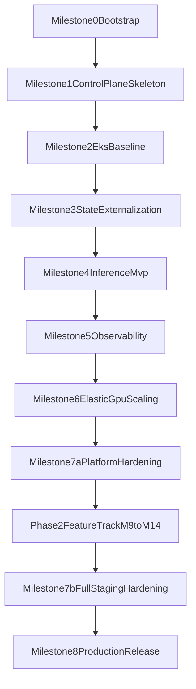

# Delivery Roadmap

## Purpose

This roadmap turns the strategy documents in this bundle into an execution sequence for the first build. It is designed for a small maintainer-led team building a new open-source repository inspired by Odysseus, with AWS EKS and vLLM as the target deployment model.

## Delivery Principles

- deliver a working baseline before optimizing elasticity
- keep the application usable even if GPU inference is degraded
- externalize state before attempting true horizontal scaling
- add observability before tuning autoscaling
- treat licensing, provenance, and governance as first-class deliverables

## Workstream Model

The roadmap assumes four workstreams:

- **product-app**: app control plane, auth, orchestration, provider routing
- **platform-infra**: VPC, EKS, storage, IAM, packaging, environments
- **ml-inference**: vLLM serving, model lifecycle, scaling signals
- **governance-security**: licensing, provenance, policies, branch controls

## Milestone 0: Project Bootstrap

### Objective

Create a clean new public repo with governance and structure in place before code import or implementation starts.

### Main tasks

- choose project name and branding
- create repository
- add `LICENSE`, `NOTICE`, `CONTRIBUTING.md`, `CODE_OF_CONDUCT.md`, `SECURITY.md`, `CODEOWNERS`
- move the planning bundle into `docs/`
- enable branch protection and DCO or equivalent sign-off workflow

### Primary workstreams

- governance-security
- platform-infra

### Exit criteria

- public repo exists
- merge protection is active
- project policies are visible from the root
- implementation directories exist and are empty but structured

## Milestone 1: Control Plane Skeleton

### Objective

Stand up the first working application skeleton without GPU dependency.

### Main tasks

- create app service scaffold
- implement basic configuration model
- implement health endpoints
- define internal inference client interface
- define initial auth and session model

### Primary workstreams

- product-app

### Dependencies

- Milestone 0 complete

### Exit criteria

- app builds locally and in CI
- app container image is produced
- control-plane API starts without local-only filesystem assumptions

## Milestone 2: EKS Baseline Deployment

### Objective

Deploy the control plane to AWS EKS on CPU nodes with one replica and managed persistence foundations.

### Main tasks

- provision base AWS infrastructure
- create EKS cluster
- configure ingress, DNS, and TLS
- deploy app to dev environment
- integrate managed database and S3

### Primary workstreams

- platform-infra
- product-app

### Dependencies

- Milestone 1 complete

### Exit criteria

- one app replica is running in EKS
- public ingress works
- app can read/write managed persistence services
- deployment is reproducible through infra and deploy definitions

## Milestone 3: Stateful Dependency Externalization

### Objective

Remove remaining local-state assumptions and prepare for safe scaling.

### Main tasks

- migrate database assumptions to PostgreSQL
- move upload and artifact paths to S3-backed flows
- choose and integrate vector storage
- isolate or remove local-only background processes

### Primary workstreams

- product-app
- platform-infra

### Dependencies

- Milestone 2 complete

### Exit criteria

- no production-critical feature depends on local bind-mounted disk
- local-state dependencies are either removed, replaced, or explicitly deferred

## Milestone 4: Inference Plane MVP

### Objective

Introduce a standalone vLLM inference service on GPU nodes and connect it to the app.

### Main tasks

- deploy vLLM on isolated GPU capacity
- expose internal-only inference endpoint
- implement model routing from app to inference
- define timeout, fallback, and degraded behavior

### Primary workstreams

- ml-inference
- product-app
- platform-infra

### Dependencies

- Milestone 3 complete

### Exit criteria

- app can successfully send inference requests to vLLM in EKS
- failure modes are visible and handled
- app remains operational if inference is unavailable

## Milestone 5: Observability Baseline

### Objective

Add enough metrics, logs, traces, dashboards, and alerts to safely operate the system.

### Main tasks

- deploy Prometheus-compatible metrics collection
- deploy Grafana or managed equivalent
- deploy GPU metrics exporter
- instrument app and inference metrics
- define first alert set and first dashboards

### Primary workstreams

- platform-infra
- ml-inference
- product-app

### Dependencies

- Milestone 4 complete

### Exit criteria

- app, cluster, and GPU dashboards exist
- key alerts are firing in test conditions
- request path can be debugged via logs and traces

## Milestone 6: Elastic GPU Scaling

### Objective

Enable demand-driven GPU capacity scaling with clear service behavior during cold starts or spot shortages.

### Main tasks

- implement GPU capacity policy
- choose managed GPU group or Karpenter transition path
- wire autoscaling metrics for inference
- test queueing, warm-pool, and fallback behavior

### Primary workstreams

- ml-inference
- platform-infra

### Dependencies

- Milestone 5 complete

### Exit criteria

- inference scaling reacts to real demand signals
- cold-start behavior is documented and acceptable
- production fallback policy is tested

## Milestone 7a: Platform Hardening (minimal, pre–Phase 2)

> M7 is split into two passes. M7a runs **immediately after M6** and locks in
> operational hygiene against the platform baseline before Phase 2 features
> (M9–M14) land on top of it. M7b runs **at the end of Phase 2** and exercises
> the full production-like topology that by then includes Phase 2 surfaces.

### Objective

Make the M6 platform baseline operationally safe before any product features
are layered on it.

### Main tasks

- run a security-posture review of what is shipped through M6 (auth, secret
  handling, network exposure, IAM scoping for the M6 scaling controllers)
- verify rollback and intentionally failed deployments recover cleanly
- verify managed-database backup and restore on the dev environment
- verify object-storage versioning/lifecycle policies are in force
- verify branch protection and the contribution flow operate as documented in
  `docs/04-governance-and-contribution.md`

### Primary workstreams

- governance-security
- platform-infra

### Dependencies

- Milestone 6 complete

### Exit criteria

- security posture of the M0–M6 surface is reviewed and documented
- backup/restore and rollback drills have been performed at least once
- known operational risks at the platform layer are recorded and owned

### Non-goals

- staging soak under production-like load (deferred to M7b)
- multi-tenant or feature-driven attack-surface review (deferred to M7b once
  Phase 2 features exist)

## Milestone 7b: Full Staging Hardening (post–Phase 2)

### Objective

Make the system a production candidate in a staging environment that behaves
like production and includes the Phase 2 feature surface (M9–M14, whichever
have been adopted).

### Main tasks

- run staging soak tests against the full production-like topology, now
  including any adopted Phase 2 features
- verify rollback and failed-deployment recovery across the expanded surface
- re-verify data backup/restore (including any Phase 2 datastores such as a
  vector index)
- conduct a security-posture review focused on Phase 2 additions: agent/tool
  sandbox boundaries, MCP credential scoping, per-tenant isolation, and
  prompt-injection defenses
- confirm branch protection and the contribution flow remain in force

### Primary workstreams

- all workstreams

### Dependencies

- Milestone 7a complete
- All Phase 2 milestones that the release intends to include are complete

### Exit criteria

- staging behaves like production architecture across the platform + adopted
  Phase 2 features
- recovery procedures are documented for every datastore in the build
- major operational risks across platform and features are known and owned

## Milestone 8: Production Release

### Objective

Launch the first public production-capable version with operational coverage,
including any Phase 2 features that have passed M7b.

### Main tasks

- publish release notes that accurately reflect platform + Phase 2 scope
- finalize public docs
- enable production deployment
- confirm baseline SLOs from `docs/07-observability.md` and any Phase 2 SLOs
  are tracked in production
- monitor early production usage and incident patterns

### Primary workstreams

- all workstreams

### Dependencies

- Milestone 7b complete

### Exit criteria

- production deployment succeeds
- baseline SLOs are being tracked
- maintainers have runbooks for incidents, scaling, and rollback covering both
  platform and adopted Phase 2 features

## Dependency Graph

The execution order is M0–M6 → M7a → Phase 2 (M9–M14, adoption-gated) → M7b →
M8. Phase 2 milestones are individually optional; M7b and M8 close out
whatever set has been adopted.

## Suggested Team Focus Per Milestone

### Early milestones

- governance-security drives Milestone 0
- product-app drives Milestone 1
- platform-infra drives Milestone 2

### Middle milestones

- product-app and platform-infra share Milestone 3
- ml-inference becomes primary in Milestone 4 and 6
- observability is shared across all technical workstreams in Milestone 5

### Late milestones

- all workstreams converge in staging and production milestones

## Recommended Checkpoints

At the end of each milestone, review:

- technical debt introduced
- licensing and provenance impact of newly imported code
- security implications of new dependencies
- whether the next milestone can proceed without hidden blockers

## First Three Immediate Actions

1. bootstrap the new repo with governance files and `docs/`
2. define the minimum control-plane contract and internal inference API
3. choose the first concrete AWS stack decisions from the decision matrix
