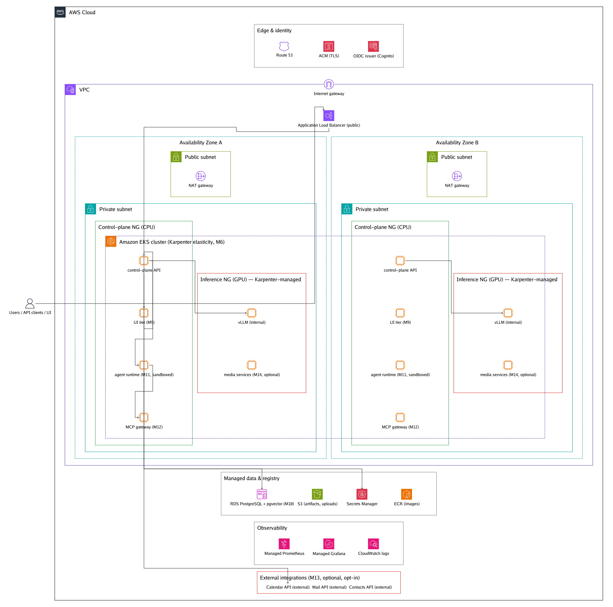
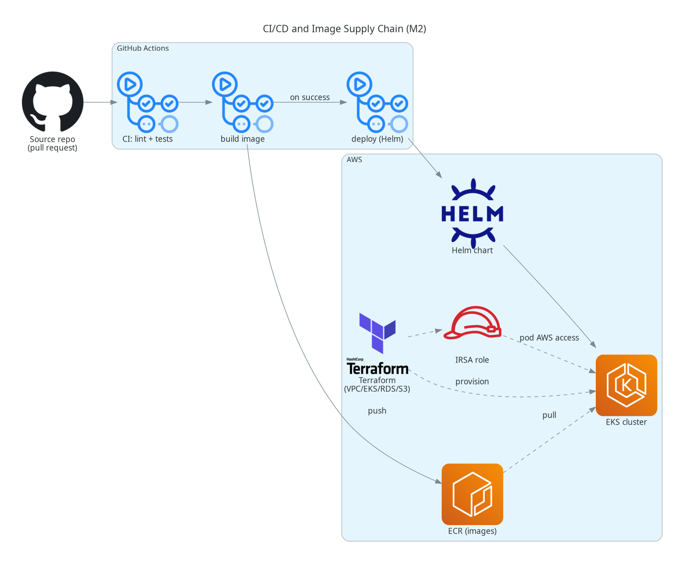
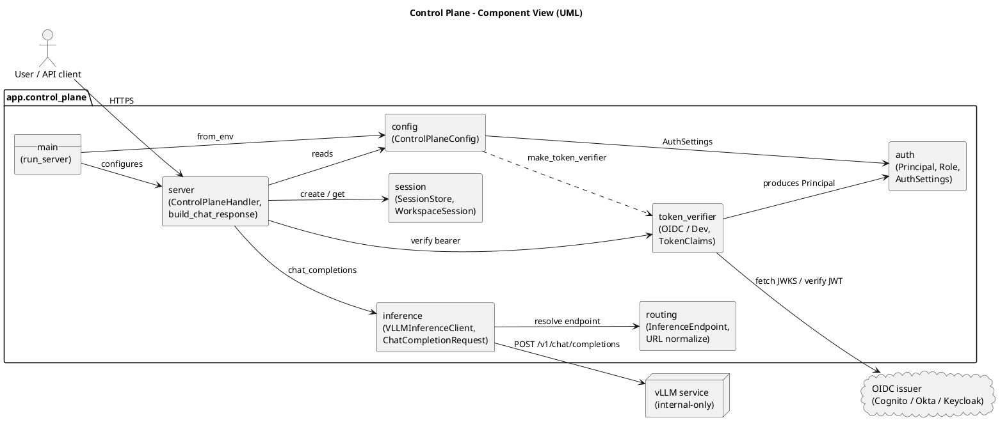
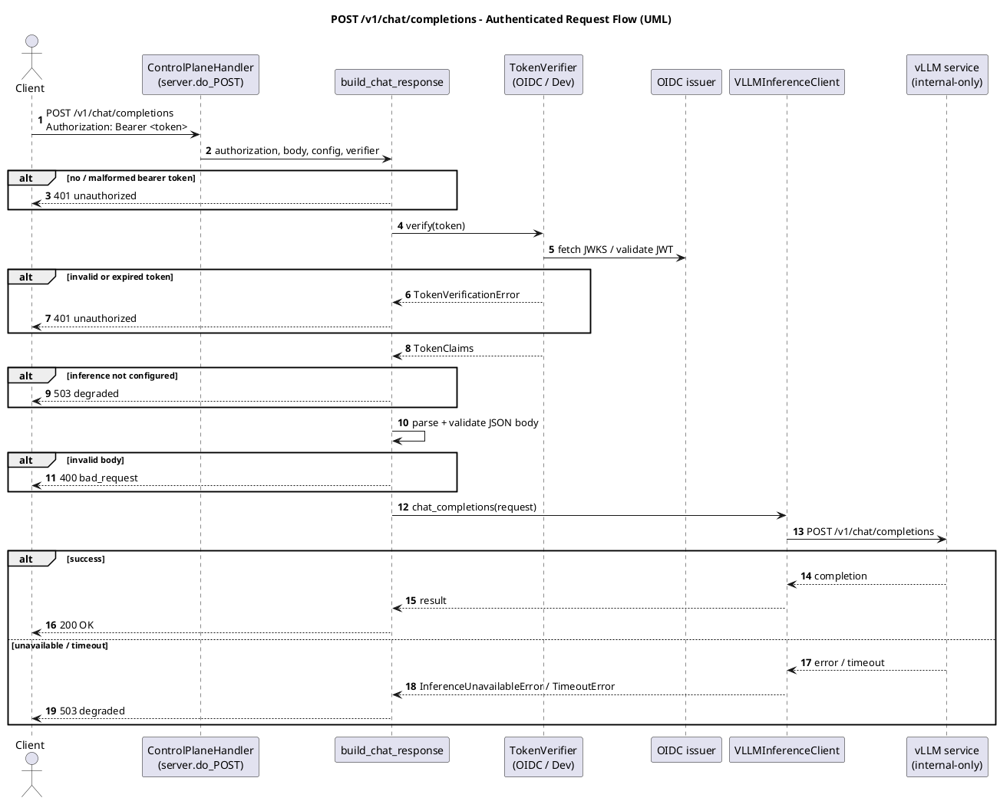

# Diagram Gallery

All diagrams are maintained as **diagram-as-code** and rendered to PNG so they
render on GitHub without a build step. The source files live in `src/`; the
PNGs are committed alongside them.

- **AWS infrastructure** (the Phase 1 baseline) uses
  [`awsdac`](https://github.com/awslabs/diagram-as-code) for the classic AWS
  reference style: an AWS Cloud frame with VPC, public/private subnets across
  Availability Zones, and official AWS icons.
- **Conceptual AWS diagrams** (Phase 2 feature roadmap, CI/CD) use the
  [`diagrams`](https://diagrams.mingrammer.com/) Python library, which also
  renders non-AWS elements (GitHub, vector store, etc.).
- **Software views** use **UML** authored in PlantUML.

Regenerate everything with:

```bash
scripts/generate-diagrams.sh
```

## AWS Infrastructure (awsdac)

### Phase 1 — Platform Baseline (M0–M6 + M7a)

Target topology for the platform baseline plus the minimum pre-Phase-2
hardening pass.  GPU capacity is elastic (Karpenter, M6) but the diagram
shows the static structural picture: 2 AZ VPC, public/private subnets,
ALB at the edge, CPU control-plane and GPU inference node groups, managed
state, and observability.

Source: [`src/phase1_baseline.yaml`](src/phase1_baseline.yaml)


### Phase 2 + Closeout — Post–Phase-2 Production Topology (Phase 2 + M7b + M8)

Target topology after Phase 2 features (M9–M14, individually adoption-gated)
have been adopted and pass M7b's full staging soak.  Compared to the Phase 1
diagram this adds: UI tier (M9), agent runtime (M11, sandboxed), MCP gateway
(M12), media services (M14, optional, on GPU), pgvector annotation on RDS
(M10), and an optional external-integrations egress lane (M13).

Source: [`src/phase2_baseline.yaml`](src/phase2_baseline.yaml)



## Conceptual AWS Diagrams (Python `diagrams`)

### Phase 2 — Proposed Feature Additions (M9+)

Component-level view of the Phase 2 feature track, complementary to the
awsdac topology diagram above.

Source: [`src/phase2_features.py`](src/phase2_features.py)


### CI/CD and Image Supply Chain (M2)

Source: [`src/cicd_pipeline.py`](src/cicd_pipeline.py)



## Software Views (UML / PlantUML)

### Control Plane — Component View

Source: [`src/control_plane_components.puml`](src/control_plane_components.puml)



### `POST /v1/chat/completions` — Request Flow

Source: [`src/chat_sequence.puml`](src/chat_sequence.puml)



## Toolchain

| Output | Tool | Extra prerequisite |
| --- | --- | --- |
| `*.yaml` AWS infra diagrams | [`awsdac`](https://github.com/awslabs/diagram-as-code) | binary auto-downloaded to `.cache/`; network on first run |
| `*.py` conceptual diagrams | [`diagrams`](https://diagrams.mingrammer.com/) (Python) | Graphviz `dot` binary |
| `*.puml` UML diagrams | PlantUML | Java 11+ (jar auto-downloaded to `.cache/`) |

The diagram tooling is development-only and is not a runtime dependency of the
control-plane application.
